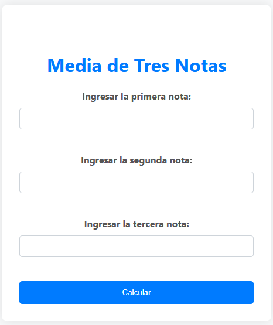

# Calculadora de Media de Notas

Esta actividad web permite a los usuarios ingresar tres calificaciones y calcular la media aritmética de las mismas. Basado en el resultado, la aplicación proporciona una evaluación cualitativa del desempeño. La interfaz está desarrollada en HTML y CSS, mientras que el procesamiento y la lógica del cálculo se manejan en PHP.

  

El script PHP procesa los datos ingresados en el formulario:

- **Obtención de Datos:** Recibe las notas ingresadas a través de $\_POST.

- **Cálculo de la Media:** Calcula la media aritmética de las tres notas ingresadas y redondea el resultado.

- **Determinación del Mensaje:** Basado en el valor de la media, asigna un mensaje de evaluación cualitativa.

- **Generación de Salida:** Imprime las notas ingresadas, la media calculada y la evaluación correspondiente.

Esta actividad demuestra habilidades en el desarrollo de aplicaciones web interactivas utilizando tecnologías de front-end y back-end, ofreciendo una experiencia de usuario eficiente y visualmente agradable.

**Consulta la versión preliminar de la actividad aquí:** [https://ejercicio_03.com](https://alejandrovillegas.net/projects/exercise-03/index.html)

# 📌 Información de la Actividad

Esta actividad ha sido desarrollado como parte del portafolio de soluciones tecnológicas, con el objetivo de ofrecer una herramienta eficiente y funcional para usuarios autodidactas interesados en la gestión y desarrollo de proyectos web.

- **Área**: Desarrollo de Actividades Web

- **Usuario Final**: TecNM

- **Fecha de Desarrollo**: 10 de marzo de 2018

- **Portafolio de Proyectos**: [www.alejandrovillegas.net](https://www.alejandrovillegas.net/)

## 🔧 Guía de Instalación y Configuración de la Actividad

1. Descargue y descomprima el archivo del proyecto en su sistema local.

La actividad ahora está funcionando en su entorno local. 🎉
